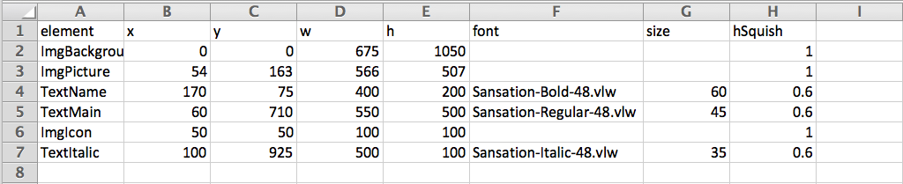
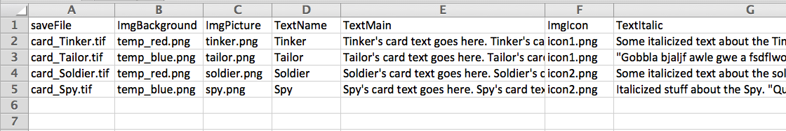
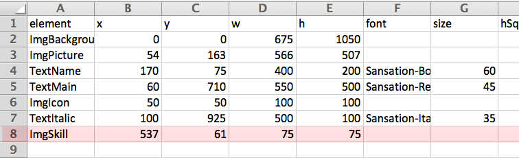

CardCreator
===========

A Processing script to help automate Playing Card creation

The Problem
===========

Making changes to a lot of cards can be time-consuming if you are manually editing and saving each card separately. This program attempts to make this easier with a customizable template file, so you can regenerate all cards instantly whenever you change the layout, add/remove design elements, or edit your art files and game text.

Setup
=====

To see an example:

1. Download and install [Processing](http://www.processing.org/)
2. Clone or download CardCreator to your local machine.
3. Open _CardCreator.pde_ in the Processing IDE.
4. Hit Play 

 
5. Four example card files should appear in your CardCreator directory

How it Works
============

_CardCreator.pde_ builds each card file by layering text and image elements according to two files, a _template_ and a _content_ sheet.

_Template.csv_ lists all elements (images and text) to include in every card, including the x/y positions, width, and height of each element type in pixels.
 

- The first elements listed in _template.csv_ are placed first, so they will be covered by any elements listed further down.

_Content.csv_ represents each card as a separate row. These rows contain the card's unique text & images, which will be placed according to the rules given for their corresponding elements in _template.csv_. 

- For image elements, _content.csv_ stores the image filename. (This must be in the data folder)
- For text elements, _content.csv_ lists the actual game text to display.

How to Use It
=============

_Apart from changing all the art and editing the game text in contents.csv, you'll probably also want to modify the template itself. Here's an example:_

Say I want to add a Pilot icon to certain cards to show that those characters can fly spaceships.

1. First, I create the pilot icon and save this in the data folder. For this example, I'm calling it "_pilot.png_"

 

2. Now I need to say where this icon goes, so I open _template.csv_. I create a new row, type an element name (I'm calling it 'ImgSkill') and define some x and y coordinates, along with the width(w) and height(h) to display the image at in pixels.
  
  - Important: For image elements, the element value must start with 'Img'. For text elements, it must start with 'Text'.
  - Also Important: Currently, you must define an x, y, w, and h value for each element. For text, you also need to choose a size and font. hSquish, the percentage to squish the text by horizontally, is optional.
3. Now I want to define what characters get to be pilots so I open _content.csv_. I create a new column and type the same Element name I created in _templates.csv_: 'ImgSkill'. For each card I want to make a pilot, I paste the filename of the pilot image. By leaving the others blank, they won't get the pilot icon.
  
4. I save _template.csv_ and _content.csv_.
  - Make sure to save these as .csv's if editing in Excel. Ignore the warning to save as xlsx.
5. Now I open _CardCreator.pde_ and hit the play button again. My updated cards should appear in the CardCreator folder. Since I said that Spy gets the pilot.png icon for her ImgSkill, she now has that icon. Tailor doesn't.

  
