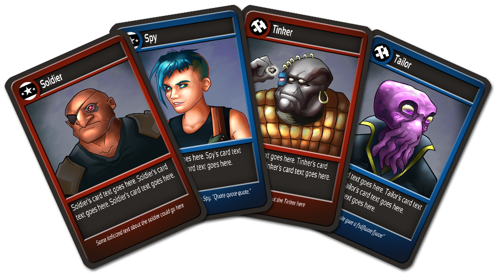
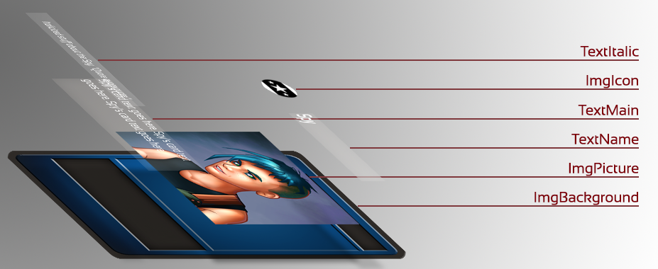
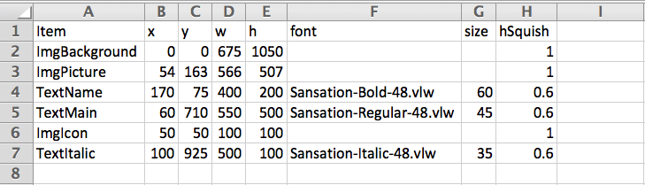
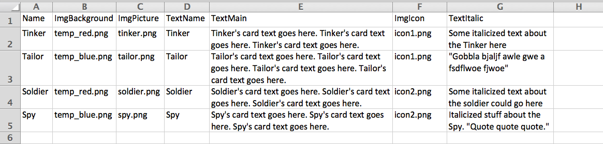

CardCreator
===========

A Processing script to help automate playing card design

Setup
=====

1. Download and install Processing [here](http://www.processing.org/)
2. Clone the CardCreator folder to your local machine
3. Open CardCreator.pde in the Processing IDE
4. Hit Play
5. Four example card files should appear in your CardCreator directory

How it Works
============

CardCreator builds each card file by layering text and image elements according to a template and a content file.

Template.csv lists all elements (images and text) to include in every card, including the x & y position, width, and height of each element in pixels.

Content.csv lists all your cards. Each row stores the unique text or image to use for the element shown in the header, defined in Template.csv. For images, content.csv gives the filename of the image to display. For text elements, it includes the actual text to place on the card.

When CardCreator.pde runs, it builds each card by looking up its row in contents.csv. There, it finds the text or image to use for each element defined in the template, and refers to template.csv to place it. The first elements listed in template.csv are placed first, so they will be covered by any elements listed further down.

How to Use It
=============

Say you want to add a Pilot icon to certain cards to show that those characters can fly spaceships.

1. Create the icon image. Put this in the data folder.
2. Open template.csv. Add a new row, give it a recognizable Item name and define the x and y coordinates of where to place the icon, and the width(w) and height(h) of the image in pixels.
  - Important: For image elements, the Item value must start with 'Img'. For text elements, it must start with 'Text'.
3. Open content.csv. Add a column and place the same Item name you created in the templates.csv file. For each card you want to be able to fly, type the filename of the pilot image. By leaving the others blank, they won't get a pilot icon.
4. Save template.csv and content.csv.
  - Make sure to save these as .csv's if editing in Excel. Ignore the warning to save as xlsx.
5. Open CardCreator.pde and hit the play button again. Your updated cards should appear in the CardCreator folder.
